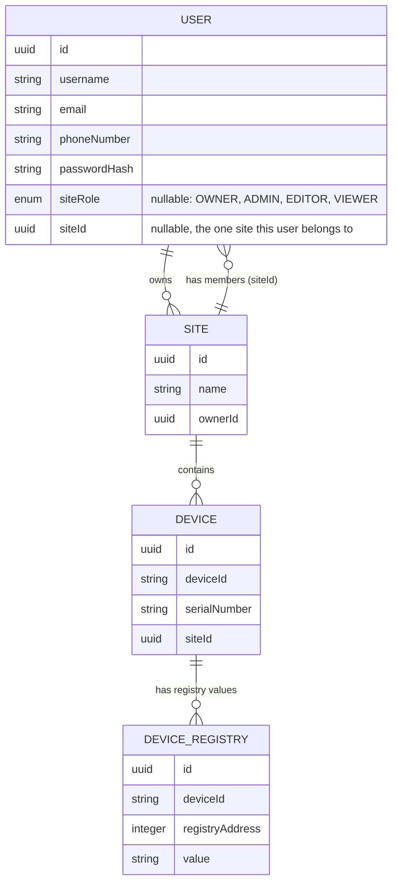

# ECO-SMART System Architecture Document

## Status

* **Version:** 3.0.0
* **Date:** July 08, 2026
* **Classification:** Proprietary / Confidential
* **Author:** Lead Software Architect
* **Target Audience:** Engineering Teams, AI Coding Assistants, System Integrators
* **Document Type:** CURRENT STATE — this document describes the system as it exists in the repository today. It does not describe target, planned, or aspirational architecture. Any future direction belongs in a separate roadmap document, not here.

---

## 1. Project Vision

ECO-SMART is a NestJS backend for provisioning and operating smart building/energy devices. A `User` owns or belongs to a `Site`, and a `Site` contains `Device`s. Devices communicate with the backend using a proprietary handshake-and-encrypted-payload protocol referred to internally as **mYBUS**.

This document intentionally omits any component not present in the codebase as of this version. Previous revisions referenced a FastAPI gateway, a Blazor WebAssembly client, gRPC transport, and a Redis-backed event bus — **none of these exist in the repository**. They have been removed from this document. If they are built in the future, this document must be updated at that time, not before.

---

## 2. What Actually Exists Today

* **One deployable service:** a single NestJS application (`backend-api`), built and run as one Docker container (`ecosmart_backend_api`).
* **One database:** PostgreSQL, accessed via TypeORM with `synchronize: true` and `autoLoadEntities: true` (see §7 for the risk this carries).
* **One outbound mail dependency:** MailHog (local dev SMTP), wired through `@nestjs-modules/mailer`.
* **No Redis, no message broker, no gRPC, no separate gateway process, and no frontend code** in this repository.

```
┌────────────────────────────┐
│   HTTP Client (any)         │
└──────────────┬───────────────┘
               │ HTTPS/HTTP, JSON, Authorization: Bearer <token>
               ▼
┌───────────────────────────────────────────┐
│           NestJS Backend (single process)   │
│  application/  →  bootstraps app             │
│  platform/identity/  →  auth + users          │
│  products/eco-smart/modules/  →  sites, devices│
│  infrastructure/mybus/  →  device crypto layer │
└──────────────┬───────────────┬───────────────┘
               │ TypeORM         │ SMTP
               ▼                 ▼
      ┌──────────────┐   ┌──────────────┐
      │  PostgreSQL   │   │   MailHog    │
      └──────────────┘   └──────────────┘
```

Devices talk to the same NestJS process directly over HTTP (`/devices/handshake`, `/devices/data`) — there is no separate gateway or protocol translation service.

---

## 3. Domain Model (Current)

Three entities exist. There is no fourth entity, no `SiteMember` join table, and no `Client`/tenant concept.

* **User** — `users` table. Belongs to at most one `Site` at a time (`user.siteId`, `user.siteRole`). May separately own zero or more `Site`s (`user.ownedSites`, via `Site.ownerId`).
* **Site** — `sites` table. Has one owner (`Site.owner` → `User`), has zero or more member `User`s (`Site.users`, one-to-many via `user.siteId`), and has zero or more `Device`s.
* **Device** — `devices` table. Belongs to exactly one `Site` (`ManyToOne`, `onDelete: 'CASCADE'`).

Supporting entities that exist but are not core domain concepts:
* **PasswordReset** (`password_resets` table) — short-lived reset codes for email/phone flows.
* **DeviceRegistry** (`device_registries` table) — stores individual `(deviceId, registryAddress) → value` pairs used by the mYBUS `READ`/`WRITE` application layer; distinct from the `Device` entity itself.



**Important asymmetry to be aware of:** a `User` can only belong to one `Site` at a time as a member (single `siteId` column), but can *own* multiple `Site`s independently of that membership. There is no many-to-many membership table. If multi-site membership per user is ever required, this is a schema change, not a bug fix.

---

## 4. Folder Structure (as it exists)

```
backend-api/src/
├── application/
│   ├── main.ts                   # bootstrap: CORS, ValidationPipe, Swagger, listen(3000)
│   ├── app.module.ts             # root module, wires TypeOrmModule/MailerModule/all feature modules
│   └── health/                   # HealthController — GET /health
├── common/
│   ├── constants/auth.constants.ts
│   ├── auth.constants.ts         # duplicate of the above — should be deleted
│   ├── export                    # extensionless file, duplicate content — should be deleted
│   ├── decorators/roles.decorator.ts     # @Roles(...SiteRole[])
│   ├── enums/site-role.enum.ts           # SiteRole: OWNER, ADMIN, EDITOR, VIEWER
│   ├── roles.enum.ts                     # UserRole: ADMIN, OPERATOR, USER — unused legacy enum, not referenced by any guard or entity; candidate for deletion (see §8)
│   ├── guards/jwt-auth.guard.ts          # AuthGuard('jwt')
│   ├── guards/jwt-refresh.guard.ts       # AuthGuard('jwt-refresh')
│   ├── guards/roles.guard.ts             # checks user.siteRole against @Roles metadata
│   ├── interceptors/accounting.interceptor.ts  # audit-log interceptor, see §6
│   ├── interfaces/jwt-payload.interface.ts     # currently empty
│   └── middlewares/request-context.middleware.ts # currently empty
├── platform/identity/
│   ├── auth/
│   │   ├── auth.module.ts, auth.controller.ts, auth.service.ts
│   │   ├── jwt-access.strategy.ts, jwt-refresh.strategy.ts
│   │   ├── dto/ (login, register, refresh-token, forgot-password[-phone], reset-password, verify-email, verify-phone)
│   │   └── entities/password-reset.entity.ts
│   └── users/
│       ├── users.module.ts, users.controller.ts, users.service.ts
│       ├── repositories/users.repository.ts
│       └── entities/user.entity.ts
├── infrastructure/mybus/
│   ├── mybus.module.ts           # @Global() module
│   └── mybus-security.service.ts # ECDH, HKDF, AES-256-GCM, in-memory session map
└── products/eco-smart/modules/
    ├── sites/
    │   ├── sites.module.ts, sites.controller.ts, sites.service.ts
    │   ├── dto/ (create-site, update-site, share-site)
    │   └── entities/site.entity.ts
    └── devices/
        ├── devices.module.ts, devices.controller.ts, device.service.ts
        ├── dto/ (register-device, handshake-request, secure-data-request)
        ├── entities/ (device.entity.ts, device-registry.entity.ts)
        └── guards/device-access.guard.ts
```

There is no `src/modules/telemetry/`, no `src/modules/automation/`, and no `src/core/` directory. Any document or comment referencing them describes work that has not started.

---

## 5. Module Responsibilities (Current)

### 5.1 AuthModule (`platform/identity/auth`)
Registration (with email + phone verification codes sent via MailHog), login, refresh, forgot/reset password (email and phone variants), email/phone verification. Issues JWTs via `@nestjs/jwt`. See §6 for exact token behavior — it differs from earlier design intent.

### 5.2 UsersModule (`platform/identity/users`)
Exposes `GET /users/me` only. Provides `UsersService`/`UsersRepository` for internal lookups (`findById`, `findByEmail`, `findByUsername`, site membership helpers). Does not perform authentication.

### 5.3 SitesModule (`products/eco-smart/modules/sites`)
CRUD for sites, ownership and access checks (`SitesService.hasAccess`), used by `DeviceAccessGuard` to gate device endpoints.

### 5.4 DevicesModule (`products/eco-smart/modules/devices`)
Device registration, listing, single-device lookup (guarded), and the three-phase mYBUS handshake/data endpoints.

### 5.5 MyBusModule (`infrastructure/mybus`)
`MyBusSecurityService`: ECDH (P-256) key exchange, HKDF-SHA256 session key derivation, HMAC device-challenge verification, AES-256-GCM payload decryption. Session state is held in an **in-memory `Map`** keyed by `deviceId` (see §8 — this violates the stateless-service rule and does not survive process restart or horizontal scaling).

### 5.6 HealthModule (`application/health`)
`GET /health` → `{ status: 'OK', timestamp }`. No dependency checks (DB, mail) are performed.

---

## 6. Authentication Flow (Current — Bearer Header, Not Cookies)

```
Client                          AuthController              AuthService                 DB
  │── POST /auth/register ─────────►│                          │                          │
  │                                  │──────────────────────────►│── check username/email/phone ──►│
  │                                  │                          │◄─ save user (bcryptjs hash) ────│
  │                                  │                          │── send email+phone codes (MailHog)│
  │◄── 201 { status: pending_verification } ───────────────────│                          │
  │                                  │                          │                          │
  │── POST /auth/verify-email, /auth/verify-phone (codes) ─────►│                          │
  │                                  │                          │                          │
  │── POST /auth/login (username, password) ───────────────────►│                          │
  │                                  │                          │── bcrypt.compare ────────►│
  │                                  │                          │── sign access + refresh JWT│
  │◄── 200 { access_token, refresh_token } ─────────────────────│  (returned in JSON body)  │
  │                                  │                          │                          │
  │── subsequent requests: Authorization: Bearer <access_token> ─────────────────────────────►│
  │                                  │                          │                          │
  │── POST /auth/refresh (Authorization: Bearer <refresh_token>) ►│                          │
  │                                  │                          │── bcrypt.compare vs stored hash│
  │◄── 200 { access_token, refresh_token } (new pair) ──────────│                          │
```

Facts, stated plainly because prior documents got this backwards:

1. **Tokens are transported via the `Authorization: Bearer <token>` header**, both for access tokens (`JwtAccessStrategy` uses `ExtractJwt.fromAuthHeaderAsBearerToken()`) and refresh tokens (`JwtRefreshStrategy`, same extractor). **No `HttpOnly` cookies are set or read anywhere in this codebase.**
2. **`AuthService.login()` and `AuthService.refreshTokens()` return `{ access_token, refresh_token }` directly in the JSON response body.** This is the actual, current, intended behavior of this API — not a bug to silently fix by rewriting the docs to say otherwise.
3. The refresh token itself is never stored in plaintext: `updateRefreshToken()` bcrypt-hashes it into `user.currentHashedRefreshToken` before saving, and `refreshTokens()` compares via `bcrypt.compare`.
4. Password hashing uses **`bcryptjs`**, called directly in `AuthService` (`bcrypt.genSalt(10)`, `bcrypt.hash`, `bcrypt.compare`). The `argon2` package is present in `package.json` but is never imported or called anywhere in the codebase.
5. Email/phone verification codes are 5-digit numeric codes, SHA-256 hashed before storage, with a 30-minute expiry window on registration and a 15-minute (email) / 5-minute (phone) window on password reset.

### Known payload inconsistency
`AuthService.generateTokens()` signs a JWT payload of `{ sub, username, role }`, and `AccountingInterceptor` reads `user.role` for its audit log. **The `User` entity has no `role` column** — it has `siteRole` instead. In current code, `user.role` is always `undefined`, so the JWT payload's `role` claim and the accounting log's `role` field are both always empty. This is a real, present inconsistency in the running system, not a documentation error — it is flagged here for awareness, not silently corrected.

---

## 7. Authorization Model (Current)

* **`SiteRole`** (`common/enums/site-role.enum.ts`) is the only role enum actually used anywhere: `OWNER`, `ADMIN`, `EDITOR`, `VIEWER`. It lives on `User.siteRole` and is checked by `RolesGuard` against `@Roles(...)` metadata.
* **`UserRole`** (`common/roles.enum.ts`: `ADMIN`, `OPERATOR`, `USER`) exists as a file but is **not referenced by any guard, controller, or entity** in the current codebase. It should be treated as dead code (see §8, recommended for removal).
* `JwtAuthGuard` + `RolesGuard` protect `GET /users/me`.
* `AuthGuard('jwt')` (via `@nestjs/passport`, same underlying `jwt` strategy) protects all `/sites/*` routes.
* `DeviceAccessGuard` protects `GET /devices/:deviceId` and `POST /devices/data`: it loads the device's `Site`, then calls `SitesService.hasAccess(userId, site.id)`, which returns true if the user owns the site or is its current `siteId` member. `POST /devices/register` and `POST /devices/handshake` are **not** guarded — they are open endpoints today (devices authenticate via the mYBUS handshake itself, not a JWT).

---

## 8. Known Deviations From Stated Engineering Rules

These are present in the codebase today and are documented here for accuracy, not silently resolved:

* **Statelessness violation:** `MyBusSecurityService` holds `activeSessions: Map<string, {...}>` as instance state on a singleton provider. This contradicts the "services must remain stateless" rule elsewhere in project governance. It also means device sessions are lost on any restart and cannot be shared across horizontally-scaled instances.
* **Test bypasses in security-critical code:** `verifyDeviceChallenge()` accepts the literal string `'test_hmac'` as a valid HMAC, and `decryptMyBusData()` returns plaintext unmodified if the payload equals `'test_encrypted_payload'` or contains the substring `'action'`. These bypasses are live in the current codebase and should be removed or gated behind a non-production flag before any production deployment.
* **Insecure CORS + credentials combination:** `main.ts` sets `origin: '*'` together with `credentials: true`. Since tokens are Bearer-header based (not cookies) this doesn't leak session cookies, but the combination is nonstandard and worth a deliberate second look.
* **`synchronize: true` in TypeORM config:** auto-syncs schema from entities on every boot. Fine for local dev, unsafe for any shared/staging/production environment (can silently alter or drop columns).
* **Duplicate constant files:** `common/constants/auth.constants.ts`, `common/auth.constants.ts`, and `common/export` all define an identical `AUTH_CONSTANTS` object. Only one should exist.
* **Unused legacy enum:** `common/roles.enum.ts` (`UserRole`) has no callers.

---

## 9. Coding Standards (Current Practice, Not Aspirational)

The following are actually followed in the reviewed code and should continue to be:
* Kebab-case filenames (`device-access.guard.ts`, `jwt-access.strategy.ts`).
* PascalCase classes, camelCase members.
* UUIDv4 primary keys on every entity (`@PrimaryGeneratedColumn('uuid')`).
* DTOs with `class-validator` decorators for all controller input.

The following are stated as rules elsewhere but are **not** consistently followed and should not be assumed true when reading the code:
* "No raw exception leakage" — several catch blocks (`DevicesController.handleSecureData`) rethrow `error.message` directly from internal exceptions into a `BadRequestException`, which can leak internal detail to the client.
* "Services must be stateless" — violated by `MyBusSecurityService` (§8).
