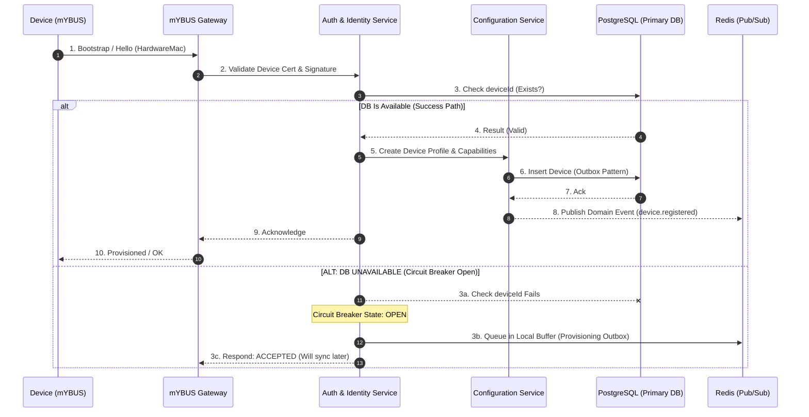
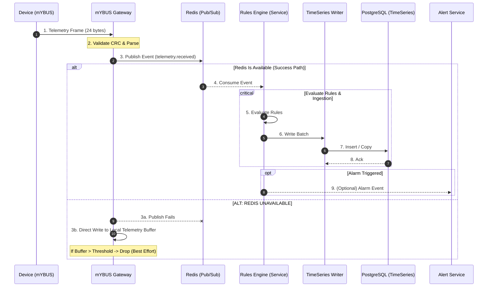

---

# SEQUENCE_DIAGRAMS.md

## Status

* **Version:** 1.0.0
* **Date:** July 01, 2026
* **Classification:** Proprietary / Confidential
* **Author:** Principal Software & IoT Architect
* **Target Audience:** Core Developers, AI Coding Assistants, Integration Engineers

---

## 1. Purpose

این سند توالی تعاملات زمانی بین مؤلفه‌های اصلی سیستم ECO-SMART را برای سناریوهای حیاتی تعریف می‌کند. این مستند شامل مسیرهای موفقیت اصلی (Main Success Paths) و مسیرهای جایگزین خطا (Alternative/Failure Paths) بر اساس استراتژی‌های تاب‌آوری و بودجه‌بندی زمانی تعریف شده در `FAILURE_MODES.md` است.

---

## 2. Device Provisioning Flow

### 2.1. Sequence Diagram (Mermaid)



### 2.2. Timeout Budget & Target

* **Target Total Latency:** $< 2,000 \text{ ms}$
* **Breakdown:** Gateway: $500\text{ms}$ | Auth: $300\text{ms}$ | Config: $500\text{ms}$ | DB: $500\text{ms}$ | Redis: $200\text{ms}$

---

## 3. Telemetry Flow (High Frequency)

### 3.1. Sequence Diagram (Mermaid)



### 3.2. Resiliency & Budgets

* **Delivery Semantic:** Best Effort (Loss Tolerant, Duplicate Tolerant)
* **Timeout Budget:** $< 250 \text{ ms}$ (CRC/Parse: $5\text{ms}$ | Publish: $10\text{ms}$ | Rules: $20\text{ms}$ | Write: $30\text{ms}$ | ACK: $< 100\text{ms}$)

---

## 4. Firmware Update (OTA) Flow

### 4.1. Sequence Diagram (Mermaid)

```mermaid
sequenceDiagram
    autonumber
    participant Admin as Admin / UI
    participant Firmware as Firmware Service
    participant Registry as Device Registry
    #160;   participant Redis as Redis (Pub/Sub)
    participant GW as mYBUS Gateway
    participant Device as Device (mYBUS)
    participant Audit as Audit Service

    Admin->>Firmware: 1. Upload Firmware
    Note over Firmware: 2. Store & Scan (Validate)
    Firmware->>Registry: 3. Create Release (Version & Target)
    Registry->>Redis: 4. Publish Update Command (ota.update.initiated)
    Redis-->>GW: 5. Deliver Command
    GW->>Device: 6. Start Download (Chunked)
    
    loop Until Complete
        Device-->>GW: 7. Download Ack (Chunk)
    end
    
    Note over Device: 8. Verify & Install
    Device->>Redis: 9. Update Status (ota.update.completed)
    Redis-->>Registry: 10. Persist Status
    Registry->>Audit: 11. Audit Log

    alt ALT FLOW A: DOWNLOAD FAIL / TIMEOUT
        Note over GW,Device: Retry (Configurable Policy) -> Max Retries > Mark FAILED
    else ALT FLOW B: INSTALL FAIL / VERIFY FAIL
        Note over Device: 8a. Rollback to Previous Version
        Device->>Redis: 8b. Publish Alert Event
    end

```

### 4.2. Target Semantics

* **Delivery Semantic:** Target Semantic = Exactly-once Effect (Idempotent via `correlationId` + `deviceId`)
* **Timeout Budget:** $< 120,000 \text{ ms}$ (120 s)

---

## 5. General Notes

* **Traceability:** تمام رویدادها ملزم به حمل هدر استاندارد شامل `eventId`, `eventType`, `eventVersion`, `correlationId`, `causationId` و `timestamp` هستند.
* **Idempotency Key:** کلید همپوشانی برای عملیات‌های تغییر وضعیت فیزیکی سخت‌افزار برابر با ترکیب `correlationId` + `entityId` خواهد بود تا از اجرای چندباره پکت‌های بازنشانی ممانعت شود.

---

این متن ساختاریافته را می‌توانی مستقیم در فایل `docs/SEQUENCE_DIAGRAMS.md` پروژه قرار دهی. گام بعدی ما تدوین سند نهایی ارکستراسیون داکر، یعنی **`DEPLOYMENT.md`** است. برای شروع این فاز اعلام آمادگی کن!